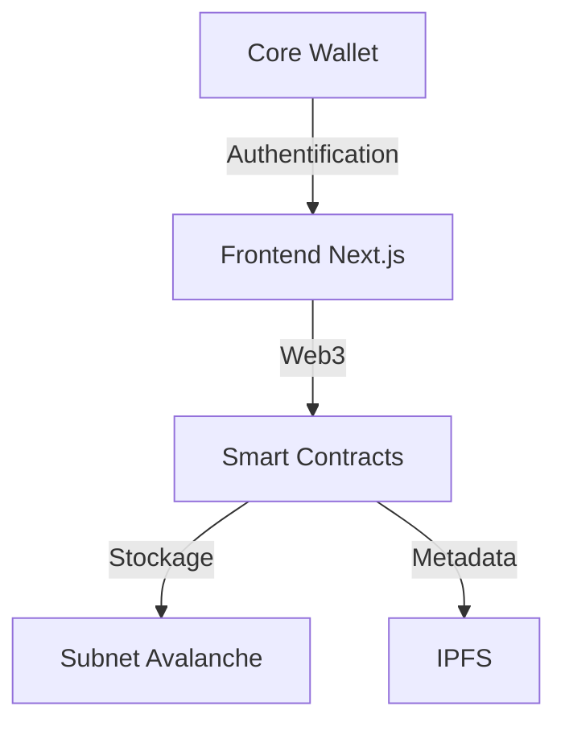

# L3ARN - Plateforme de Certificats Académiques NFT ESGI


L3ARN est une plateforme décentralisée de gestion des certificats académiques utilisant la technologie blockchain. Développée pour l'ESGI, elle permet l'émission, la vérification et la gestion des diplômes sous forme de NFTs sur une Subnet Avalanche dédiée.

## 🎯 Fonctionnalités Principales

- **Émission de Certificats** : Création de NFTs représentant les diplômes
- **Vérification Décentralisée** : Validation transparente des certifications
- **Gestion des Accès** : Système de rôles (Admin, École, Étudiant)
- **Interface Intuitive** : Dashboard moderne et responsive
- **Sécurité Avancée** : Protocoles de sécurité blockchain

## 🏗 Architecture



## 🚀 Installation Rapide

### Prérequis
- Node.js ≥ 18.x
- npm ≥ 9.x
- Foundry
- Avalanche CLI
- Core Wallet

### Configuration Complète

1. **Cloner le repository**
```bash
git clone https://github.com/0xNaxzerrr/L3ARN.git
cd L3ARN
```

2. **Smart Contracts**
```bash
cd contracts
forge install
forge build
```

3. **Frontend**
```bash
cd ../front
npm install
npm run dev
```

4. **Subnet Avalanche**
```bash
avalanche subnet deploy ESGI --local
```

## 🌐 Configuration du Réseau

### Subnet ESGI Local
- **Network Name**: ESGI
- **RPC URL**: http://127.0.0.1:40679/ext/bc/2jD94QhBWwFPfjgKkDjqZdXMAmPvnzC75UVAUxU4iGmsT8MSmT/rpc
- **Chain ID**: 99999
- **Symbol**: AVAX

### Comptes de Test
| Rôle | Adresse | Balance |
|------|----------|---------|
| Admin | 0x8db97C7cEcE249c2b98bDC0226Cc4C2A57BF52FC | 1,000,000 AVAX |
| Manager | 0x5c652596dbe51ed3d5DDA47f2790236FB6c77537 | 10 AVAX |
| Test | 0x2875618c9bAeE0C1e487f411327396619D7DF0A5 | 600 AVAX |

## 📁 Structure du Projet

```
L3ARN/
├── contracts/               # Smart contracts Solidity
│   ├── src/                # Code source des contrats
│   ├── test/               # Tests
│   └── script/             # Scripts de déploiement
│
└── front/                  # Application frontend
    ├── app/                # Pages et routes
    ├── components/         # Composants React
    └── lib/               # Utilitaires
```

## 🔧 Développement

### Smart Contracts
```bash
cd contracts
forge test        # Lancer les tests
forge script script/Deploy.s.sol --rpc-url [URL] --broadcast  # Déployer
```

### Frontend
```bash
cd front
npm run dev      # Mode développement
npm run build    # Build production
```

## 📱 Interface Utilisateur

### Rôles et Fonctionnalités

#### Admin
- Gestion des certificats
- Attribution des rôles
- Surveillance du système

#### École
- Émission de certificats
- Gestion des étudiants
- Suivi des diplômes

#### Étudiant
- Visualisation des certificats
- Partage sécurisé
- Historique académique

## 🔐 Sécurité

- Smart contracts audités
- Gestion des rôles avec OpenZeppelin
- Protocoles de sécurité blockchain
- Validation multi-signatures

## 📊 Monitoring

### Logs et Debugging
- Logs des nœuds: `~/.avalanche-cli/local/ESGI-local-node-local-network/node1/logs`
- Backend controller: `~/.avalanche-cli/local/ESGI-local-node-local-network/server.log`

### Nodes Information
- **Node1**: NodeID-7Xhw2mDxuDS44j42TCB6U5579esbSt3Lg
- **Node2**: NodeID-MFrZFVCXPv5iCn6M9K6XduxGTYp891xXZ

## 🤝 Contribution

1. Fork le projet
2. Créer une branche feature (`git checkout -b feature/AmazingFeature`)
3. Commit les changements (`git commit -m 'Add some AmazingFeature'`)
4. Push sur la branche (`git push origin feature/AmazingFeature`)
5. Ouvrir une Pull Request

## 📄 Licence

Distribué sous la licence MIT. Voir `LICENSE` pour plus d'informations.

## 📞 Support

- Créer une issue GitHub
- Documentation : [docs/](./docs)
- Email : contact@example.com

## 🙏 Remerciements

- ESGI pour le support
- Avalanche pour l'infrastructure blockchain
- OpenZeppelin pour les smart contracts