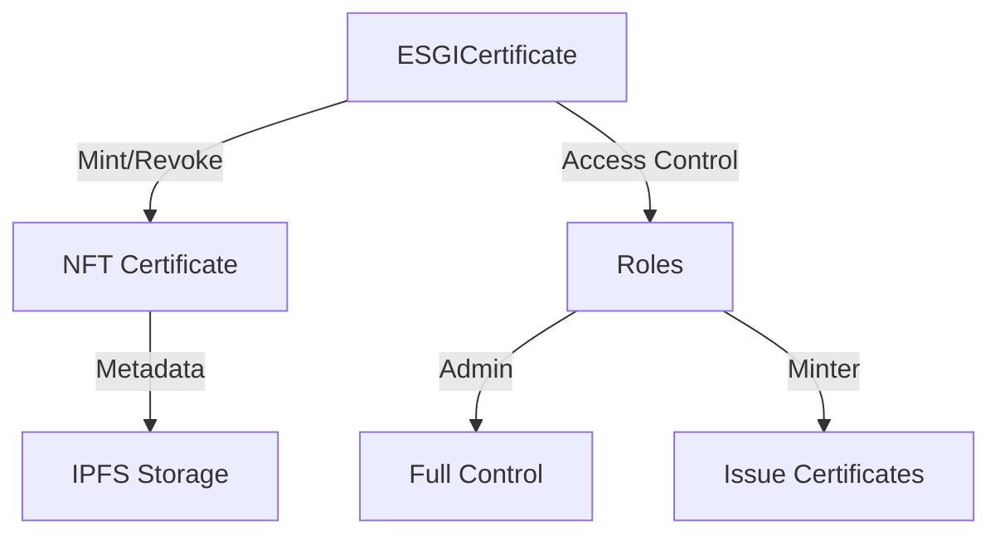

# Smart Contracts L3ARN

Smart contracts pour la gestion des certificats académiques NFT de l'ESGI sur la blockchain Avalanche.

## Architecture



## Structure des Contrats

```
contracts/
├── src/
│   ├── ESGICertificate.sol     # Contrat principal de gestion des certificats
│   └── interfaces/             # Interfaces des contrats
├── test/                       # Tests des smart contracts
├── script/                     # Scripts de déploiement
└── lib/                        # Dépendances Foundry
```

## Technologies & Frameworks

- **Solidity** ^0.8.20
- **OpenZeppelin** - Contrats standards (ERC721, AccessControl)
- **Foundry** - Framework de développement et test
- **Avalanche Subnet** - Blockchain dédiée ESGI

## Prérequis

- [Foundry](https://book.getfoundry.sh/getting-started/installation)
- [Avalanche CLI](https://docs.avax.network/tooling/cli-guides/install-avalanche-cli)

## Installation

1. Cloner le repository :
```bash
git clone https://github.com/0xNaxzerrr/L3ARN.git
cd L3ARN/contracts
```

2. Installer les dépendances :
```bash
forge install
```

## Compilation

```bash
forge build
```

## Tests

```bash
# Lancer tous les tests
forge test

# Lancer les tests avec traces
forge test -vvv

# Test d'une fonction spécifique
forge test --match-test testIssueCertificate
```

## Déploiement

### Sur le Subnet Local

1. Démarrer le subnet :
```bash
avalanche subnet deploy ESGI --local
```

2. Déployer les contrats :
```bash
forge script script/Deploy.s.sol --rpc-url http://127.0.0.1:40679/ext/bc/2jD94QhBWwFPfjgKkDjqZdXMAmPvnzC75UVAUxU4iGmsT8MSmT/rpc --broadcast
```

### Sur le Testnet/Mainnet

1. Configurer les variables d'environnement :
```bash
cp .env.example .env
# Éditer .env avec vos clés privées
```

2. Déployer :
```bash
forge script script/Deploy.s.sol --rpc-url $RPC_URL --broadcast --verify
```

## Structure des Certificats

```solidity
struct CertificateData {
    string studentName;
    uint256 studentId;
    string courseName;
    uint256 graduationYear;
    string grade;
    bool isValid;
    uint256 timestamp;
}
```

## Rôles et Permissions

- **DEFAULT_ADMIN_ROLE** : Contrôle total
  - Révoquer des certificats
  - Gérer les rôles
  
- **MINTER_ROLE** : Émission des certificats
  - Créer de nouveaux certificats
  - Mettre à jour les métadonnées

## Fonctions Principales

### Émission de Certificat
```solidity
function issueCertificate(
    address to,
    string memory studentName,
    uint256 studentId,
    string memory courseName,
    string memory grade,
    string memory uri
) public onlyRole(MINTER_ROLE) returns (uint256)
```

### Révocation de Certificat
```solidity
function revokeCertificate(
    uint256 tokenId,
    string memory reason
) public onlyRole(DEFAULT_ADMIN_ROLE)
```

## Sécurité

- Tests de couverture complète
- Utilisation de contrats OpenZeppelin audités
- Système de rôles avec Access Control
- Protection contre les réentrances

## Gas Optimisation

- Stockage optimisé des données
- Utilisation de mappings
- Events pour les données non critiques

## Events

```solidity
event CertificateIssued(
    uint256 indexed tokenId,
    uint256 indexed studentId,
    string courseName,
    uint256 timestamp
);

event CertificateRevoked(
    uint256 indexed tokenId,
    uint256 timestamp,
    string reason
);
```

## Maintenance

Pour mettre à jour les dépendances :
```bash
forge update
```

## Audit et Sécurité

Points vérifiés :
- Contrôle d'accès
- Gestion des erreurs
- Protection contre les attaques courantes
- Optimisation du gas

## Contribution

1. Fork le projet
2. Créer une branche feature
3. Commiter les changements
4. Push sur la branche
5. Ouvrir une Pull Request

## Licence

MIT